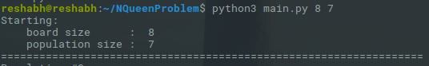
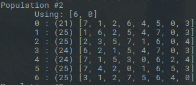
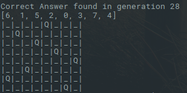

# n-QueenProblem
Solution to n-QueenProblem using genetic algorithm
---
### Dependencies Python >=3.3
### CLI parameters 
* Board Size
* Population Size
#### Default is 8x8 board and 7 unit undividual population
```
python3 main.py 18 16
```
or to use default parameters 
```
python3 main.py 
```


The population is shown as follows 



And finally the solution 


